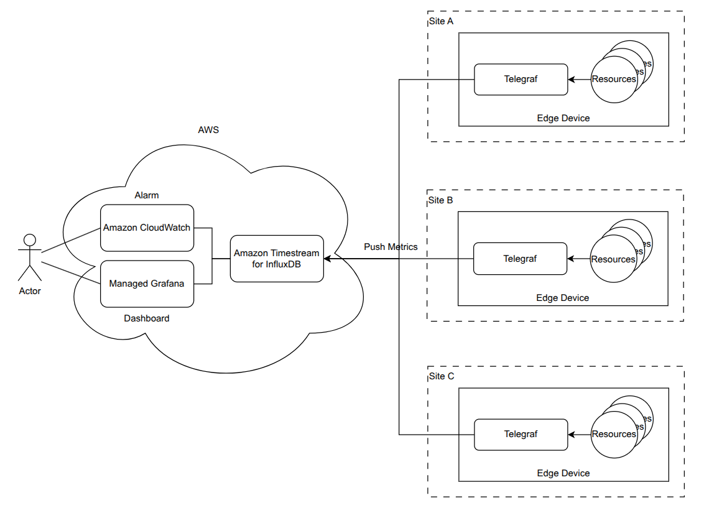
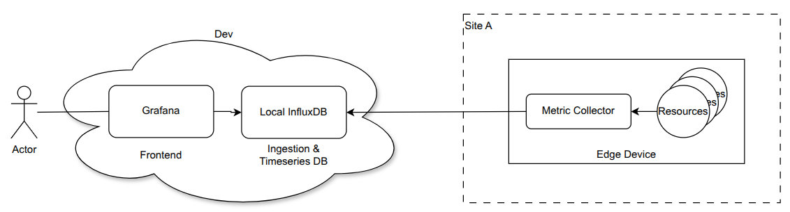

# Hardware Device monitoring solution


This repository contains scripts and container files to show how to collect utilisation metrics from major hardware devices such as CPU, memory, disk, and GPU, then push those metrics periodically to a time series database. Lastly using monitoring tool to query the metric or create a dashboard.  


## Architecture overview

Obviously, there are many well made open source or commercial softwares so that we would better to utilize those solutions instead of creating our own scripts to collect metrics unless we have a specific reason. Also, it's not the best way to achieve our goal either. However I'd like to show how we can collect metrics from multiple devices with Python and some other solutions.




I chose this architecture because:

- **Database — InfluxDB**: a high-performance time-series database (TSDB) explicitly optimized for handling massive volumes of time-stamped data, making it ideal for device monitoring, DevOps metrics, and real-time analytics. Storing metrics in a purpose-built TSDB keeps queries fast and retention/rollups simple compared to a relational database.
  
- **Collecting method — push over pull**:
  - Devices push metrics, so no inbound port needs to be opened on the device. This reduces both attack surface and the request-handling overhead on the device.
  - Across multiple sites, maintaining firewall rules for collectors to reach every device is impractical; the single outbound path to the ingestion endpoint is much easier to operate.
  - The collector does not need a device inventory or discovery mechanism (CMDB, network scan, etc.) — anything that comes online starts reporting on its own.
  - Pull would be the better fit when the inventory is fixed and lives in a trusted network, where collectors can reach every device directly. That is not the case for devices spread across locations.
  
- **Collector — Python instead of Telegraf**: Telegraf is an excellent open-source, plugin-driven agent for collecting, processing, and sending metrics, with built-in data buffering. For this project I used a small Python script instead, because the goal is a custom collector fetching CPU, memory, disk, and GPU (temperature) metrics for demo purposes. The collector stays light because it never accepts requests from outside — the trade-off is that configuration such as the DB endpoint and token
  must be maintained on every device.
  
- **Dashboard — Grafana**: query InfluxDB through SQL and visualize metrics with an auto-provisioned datasource and dashboard, so a fresh environment comes up with charts ready.
  
- **Alarming & integration — Amazon CloudWatch** (production target): trigger alarms on defined criteria and integrate with other AWS services (e.g. Lambda) to automate responses. Grafana also has built-in alerting and can send notifications to channels like Slack (or email, webhooks, etc.) when a rule meets a threshold — so in the local setup, for example, you could alert if CPU utilisation exceeds 80%. That's a natural choice while staying within open-source tooling.


## Development environment

Since there is no AWS account for development and testing, the production CloudWatch path is replaced locally with open-source tooling: the Python collector pushes metrics to a local InfluxDB 3 instance, visualized with Grafana.
All backend services run as containers via `podman-compose` (`containers/compose.yml`).



- **Metric collector (Python)**: runs on the host as a systemd service (see `docs/systemd-setup.md`) or as a container on the same docker/podman network as InfluxDB. Pushes CPU, memory, disk, and GPU metrics every 10 seconds.
- **InfluxDB 3 Core** (`influxdb3-core`, port 8181): time-series store for the `edge_dev_db` database.
- **Grafana** (port 3000): dashboards and datasource are auto-provisioned from `conf/Grafana/` on startup.
- **InfluxDB 3 Explorer** (port 8080): ad-hoc query UI for InfluxDB.


#### GPU notes

- The dev machine has an AMD integrated GPU, so AMD metrics are collected via `amdsmi`; NVIDIA collection code (`pynvml`) is included but unverified no NVIDIA hardware was available to test it [1].


## Future considerations

- **Automatic location tagging**: every point is already tagged with `device/city/region/country`, but the values come from static flags (currently defaulting to Dublin/Leinster/IE). For fleets spread across areas, populating these automatically — e.g. from an IP geolocation database at startup — would let operators filter by location and correlate events across nearby devices on the dashboard.
- **Secure communication**: the local setup uses plain HTTP with no TLS, and the ingestion endpoint must be reachable from every device, so access control on that port is critical. For production, carry the traffic over a private path (Site-to-Site VPN or Direct Connect) with TLS, and rotate the InfluxDB tokens the collectors hold — ideally by storing them in a secrets manager rather than on-device env files.


## How to test

### 1. Start the backend services

All commands run from `containers/`:

```
cd containers
podman-compose up -d influxdb3-core
podman-compose exec influxdb3-core influxdb3 create token --admin
# save the apiv3_... token (shown only once)
podman-compose exec influxdb3-core influxdb3 create database \
  --retention-period 30d edge_dev_db --token <TOKEN>
```

Put the token in

-  `containers/.env` (`INFLUXDB_TOKEN=<TOKEN>`) - Grafana's provisioned datasource reads it at startup
- `influxdb3-explorer/config.json` (`"DEFAULT_API_TOKEN": "<TOKEN>"`)  - InfluxDB3 Explorer's provisioned database configuration reads it at startup.
- (`token: <TOKEN>`)

Now bring up everything:

```
podman-compose up -d
```

This starts InfluxDB 3 Core (`:8181`), Grafana (`:3000`, datasource and dashboard auto-provisioned from `conf/Grafana/`), and the InfluxDB 3 Explorer (`:8080`).


### 2. Run the collector

Pick one:

```
# a) Locally with pipenv (from the repo root)
INFLUXDB_TOKEN=<TOKEN> pipenv run python src/main.py

# b) As a systemd service on the host
#    see docs/systemd-setup.md

# c) As a container on the same network as InfluxDB
podman build -t metric-collector .
podman run -d --name metric-collector-$$ --restart always \
  --network influxdb3_default \
  --device /dev/dri:/dev/dri --group-add keep-groups \
  -e INFLUXDB_HOST=http://influxdb3-core:8181 \
  -e INFLUXDB_DATABASE=edge_dev_db \
  -e INFLUXDB_TOKEN=<TOKEN> \
  metric-collector
```

> Note: Options (a) and (b) reach InfluxDB at the default `http://127.0.0.1:8181`; option (c) must use `http://influxdb3-core:8181` because a container's localhost is itself.


### 3. Verify

```
podman logs -f metric-collector   # or: journalctl -u metric-collector.service -f
```

Then open the Explorer at http://localhost:8080 or Grafana at http://localhost:3000 and query, e.g. `SELECT * FROM cpu ORDER BY time DESC LIMIT 10`. The provisioned dashboard includes a `device` variable (`SELECT DISTINCT device FROM cpu`).

### Notes

- **AMD GPU hosts**: the `amdsmi` PyPI package (7.0.2) lacks some APIs, so on ROCm machines install the bundled sdist instead:
  
  ```
  cp -r /opt/rocm/share/amd_smi ~/amd_smi_installer
  pipenv install ~/amd_smi_installer
  rm -rf ~/amd_smi_installer
  ```
  Containers also need the DRM runtime (`libdrm-amdgpu1`, already in the `Dockerfile`) and `--device /dev/dri`. 
  Without GPU access the collector logs a warning and still writes CPU/memory/disk metrics.
  
- **Standalone InfluxDB** (without compose):
  
  ```sh
  podman run --rm -p 8181:8181 \
    --userns=keep-id \
    -v $PWD/data:/var/lib/influxdb3/data:Z \
    influxdb:3-core influxdb3 serve \
      --node-id=my-node-0 \
      --object-store=file \
      --data-dir=/var/lib/influxdb3/data
  ```


## References
1. [Mastering NVML Python: The Ultimate GPU Monitoring Guide](https://codesamplez.com/programming/nvml-python-api-tutorial)
2. [AMD SMI Python API reference](https://rocm.docs.amd.com/projects/amdsmi/en/latest/reference/amdsmi-py-api.html#amd-smi-python-api-reference)
3. [Use InfluxDB client libraries to write data](https://docs.influxdata.com/influxdb3/core/write-data/client-libraries/)
4. [Install and run InfluxDB 3 Explorer with Docker](https://docs.influxdata.com/influxdb3/explorer/install/docker/)

5. [Build ROCm container using docker CLI](https://github.com/ROCm/ROCm-docker/blob/master/quick-start.md#step-4a-build-rocm-container-using-docker-cli)

6. [psutil API](https://psutil.io/recipes/#)
